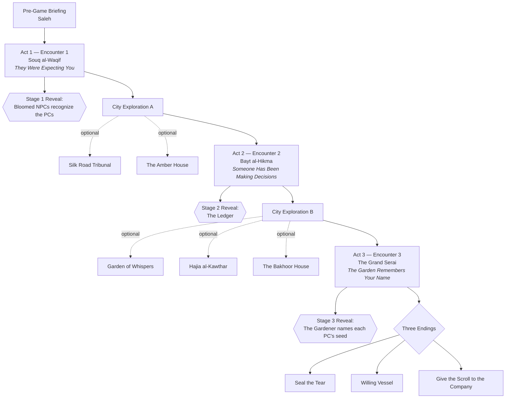

# Campaign Flow — Where All Roads Bloom
### The Complete Linear Walkthrough

← [[00 - Index]] | See also: [[Campaign Overview]] | [[Clue Trail]] | [[Trust Tracker]]

> [!abstract] What This Is
> A single-file, start-to-finish walkthrough of the session in the order it is meant to be run. Every other note in this vault covers one piece of the campaign in depth ([[Locations/Souq al-Waqif|a location]], [[NPCs/Kasim al-Nuri|an NPC]], [[Bloom Exposure Mechanic|a mechanic]]) — this note is the spine that connects them in play order. Use it to keep your place at the table; follow the embedded links out to the detail notes when you need them.

---

## The Shape of the Session

**Total runtime**: ~4–5 hours. See [[00 - Index#Session Timing Guide|the Index]] for the minute-by-minute breakdown.

---

## 0. Pre-Game — The Briefing (15 min)

**Who**: [[Saleh]], the Amber Company's field agent.
**What happens**: Saleh briefs the party. Issyldir is under "magical quarantine." Find a contact named [[Fatima Rashid]] in the market. Retrieve the **Sealed Scroll**. He carries a dried rose. He is mildly Bloomed and doesn't know it — see [[Saleh]] for his full profile.

> [!tip] DM Hook
> Hand each player a "trinket from Issyldir" they've carried for months — a trade good, fabric, a spice packet. It seemed like nothing. Let it pay off when [[The Gardener]] references it in [[Encounter 3 - The Grand Serai|Encounter 3]].

**Established here**: The players' stated mission (find the scroll) vs. their true mission (re-invoke [[The Gardener]] for [[The Amber Company]]) — see [[The Amber Company]] for the full agenda.

---

## 1. Act 1 — [[Encounter 1 - Souq al-Waqif]] (45–60 min)
### *"They Were Expecting You"*

**Location**: [[Souq al-Waqif]], the outer gate market.

The party enters [[Issyldir - The City|Issyldir]] through the main gate — see [[Issyldir - The City#Approaching the City — First Impressions|the approach read-aloud]] for the first-sight description. The gate guards ([[Bloomed Guard]]) are pleasant, rooted, and unnervingly patient.

**Key contacts**:
- **[[Fatima Rashid]]** — fractured guide, switches between "Before" and "Present" memory states. She points the party toward the library.
- **[[Rajan Pillai]]** — migrant laborer, watches from a distance, opens up if treated with basic dignity. Names [[Kasim al-Nuri]] as the man who "decides who stays."

**Horror beat**: Sana's Essences (Zone J) — a Bloomed woman tending a flower that is actually her husband's hand. No roll required; pure atmosphere.

**Stage 1 Reveal** (see [[Clue Trail#Three-Stage Player Reveal|Clue Trail]]): the fountain inscription and the Bloomed NPCs' unprompted recognition ("We've been keeping your place warm") plant the idea that the PCs were expected.

**Clues locked in before leaving** (full list in [[Encounter 1 - Souq al-Waqif#Clue Delivery|Encounter 1]]):
- The ritual happened 18 months ago, performed by seven Council members — the "Rite of the Bountiful Name."
- [[The Grand Serai]] has been sealed since.

**Combat contingency**: only if PCs are disruptive — see [[Encounter 1 - Souq al-Waqif#If Combat Triggers|If Combat Triggers]]. Escalating [[Bloomed Guard]]s, non-lethal in intent, do not pursue outside the market.

**Transition**: the party leaves the Souq bound for [[Bayt al-Hikma]].

---

## 2. City Exploration A (20–30 min, optional)

Two optional detours before Act 2 — both deepen the sabotage/Kafil thread:

- **[[Silk Road Tribunal]]** — Abbas the clerk, 94% Kafil appeal-denial statistics, [[Rajan Pillai|Rajan's]] own permit file with the damning sponsor's note.
- **[[The Amber House]]** — the Company's local archive; Harun al-Noor's correspondence and full report (the "smoking gun" for the sabotage plan); junior agent Yasmeen al-Bakri, found alive in the back room, will confess everything.

Neither stop is required to proceed — see [[Clue Trail#Minimum Viable Information|Minimum Viable Information]] for what's strictly necessary.

---

## 3. Act 2 — [[Encounter 2 - Bayt al-Hikma]] (50–60 min)
### *"Someone Has Been Making Decisions"*

**Location**: [[Bayt al-Hikma]], third-floor survivor refuge (23 survivors).

**The moral center of the adventure**. [[Kasim al-Nuri]] has kept 23 people alive through 11 "pruning" decisions — killing those he judges too Bloomed. **[[Nadia bint Yusuf]]** is scheduled for pruning tomorrow. [[Rajan Pillai|Rajan]], if brought along, may quietly point out the racial pattern in Kasim's list (9 of 11 pruned were non-native workers).

**Archive digging** (2nd floor) and **Nadia's/Parveen's rooms** (4th floor) surface the campaign's central mystery:

| Find | Reveals |
|---|---|
| The Ledger (DC10) | Every PC's name or hometown in the 140-year Kafil record — **Stage 2 Reveal** |
| Amber manifest (DC11) | Components delivered as a "gift" 19 months ago |
| Parveen's locked-drawer note (DC14 tools/DC16 STR) | Explicit written proof: *"These components were not ordered by the Council. Source: Amber Company."* |
| Nadia's journal | She's been dreaming the Gardener's perspective; Entry 23 predicted the PCs' arrival |

**Stage 2 Reveal**: The Ledger (see [[Clue Trail#Three-Stage Player Reveal|Clue Trail]]) — every player's name or hometown is already written into the city's history.

**The emotional confrontation**: presenting Kasim with the pruning pattern. Handle per [[Kasim al-Nuri#The Pattern|Kasim al-Nuri's notes]] — he is not a monster, he has simply never looked at his own decisions from above.

**Clues locked in before leaving** (full list in [[Encounter 2 - Bayt al-Hikma#Clue Delivery|Encounter 2]]):
- The ritual was sabotaged from outside by [[The Amber Company]].
- The Sealed Scroll is inside **[[Parveen]]**, in [[The Grand Serai]] — and Parveen is [[Fatima Rashid|Fatima's]] mother.

**Combat contingency**: only if PCs force the issue over Nadia or corner Kasim — see [[Encounter 2 - Bayt al-Hikma#If Combat Triggers|If Combat Triggers]] ([[Kasim al-Nuri (Combat)]] + 3× Lieutenants). Talking Kasim down (DC15 Persuasion + evidence) turns him into a **willing vessel candidate** for Act 3.

**Transition**: the party leaves for [[The Grand Serai]].

---

## 4. City Exploration B (20–30 min, optional)

Three optional detours before Act 3 — recovery and revelation:

- **[[Garden of Whispers]]** — four memory-echo visions (founding, the Kafil laws' creation, the night of the ritual, the Gardener's arrival). DC15 WIS save each or +1 Bloom Exposure. The most important lore drop in the game, entirely optional.
- **[[Hajia al-Kawthar]]** — safe rest, Advantage on Bloom saves, ablution pool removes 1 Bloom Exposure. [[Rajan Pillai|Rajan's]] secret (he's been patching the minaret) can surface here.
- **[[The Bakhoor House]]** — [[Hamid al-Sharq]] cures short-term madness, and if asked directly about the ritual components, reveals what he noticed about the "merchants" who delivered them.

---

## 5. Act 3 — [[Encounter 3 - The Grand Serai]] (50–60 min)
### *"The Garden Remembers Your Name"*

**Location**: [[The Grand Serai]], the palace heart.

The party approaches through the corrupted adhan ("Come home. Come home.") and enters the audience hall, where [[The Merchant Council of Seven]] sit fused to their table — now the **[[Bloom Council]]**.

**Stage 3 Reveal** (see [[The Gardener#The Seeds|The Gardener's notes]]): the Gardener addresses each PC by name, referencing the private "seed" planted in them over the last 18 months. WIS DC15 save or +1 Bloom Exposure. This is the payoff of the pre-game trinket hook.

**Finding Parveen**: the hidden passage behind the council table leads to the Ritual Chamber, where **[[Parveen]]** — [[Fatima Rashid|Fatima's]] mother, alive, fused to the ritual seat — answers every question the party has. If Fatima is present, this is the emotional climax of the whole adventure.

**Combat contingency**: only if PCs attack the council table — see [[Encounter 3 - The Grand Serai#If Combat Triggers|If Combat Triggers]]. [[Bloom Council]] (CR10): destroy 3 of 7 nodes to win. Zainab's node (DC14 WIS) can defuse the fight by revealing the word "sabotage."

### The Three Endings

Resolved via [[Parveen]] once the party decides — full text in [[Encounter 3 - The Grand Serai#The Three Endings|Encounter 3]]:

1. **Seal the Tear** — destroy the Sealed Scroll. [[Parveen]] dies within hours. [[The Gardener]] retreats. The city stops growing but never heals. Pyrrhic.
2. **Willing Vessel** — [[Kasim al-Nuri|Kasim]], [[Nadia bint Yusuf|Nadia]], or [[Rajan Pillai|Rajan]] offers to carry the Gardener back through the tear. The city heals slowly over years; the vessel remains in the Serai forever.
3. **Give the Scroll to [[The Amber Company]]** — the party's employers get what they wanted. Sets up a sequel: the Company will attempt this again, elsewhere.

**Final beat**: regardless of ending, the flowers brown and the Gardener's parting line closes the session: *"I only wanted you to grow."*

---

## Threads That Pay Off Across All Three Acts

| Thread | Act 1 | Act 2 | Act 3 |
|---|---|---|---|
| **The PCs are connected** | Stage 1: Bloomed NPCs recognize them | Stage 2: The Ledger has their names | Stage 3: The Gardener names their personal seed |
| **The Kafil injustice** | Rajan's worn stall, the fountain's irony | Kasim's pruning pattern (9 of 11 non-native) | Willing Vessel candidates are all Kafil-trapped survivors |
| **The sabotage** | Rumors of "the ritual going wrong" | Parveen's drawer note makes it explicit | Parveen confirms it fully, in person |
| **[[Rajan Pillai]]** | First met, distant | Points out the pattern (if trusted) | Vessel candidate |
| **[[Fatima Rashid]]** | Fractured guide | Mentions her mother, may travel with party | Reunion with [[Parveen]] |

For the underlying mechanics referenced throughout (Bloom Exposure gain/cures, madness tables), see [[Bloom Exposure Mechanic]]. For NPC relationship gates, see [[Trust Tracker]]. For the complete clue-by-clue index, see [[Clue Trail]].
